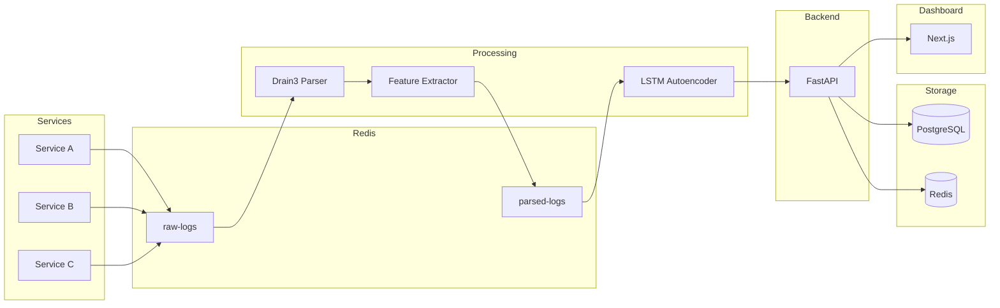
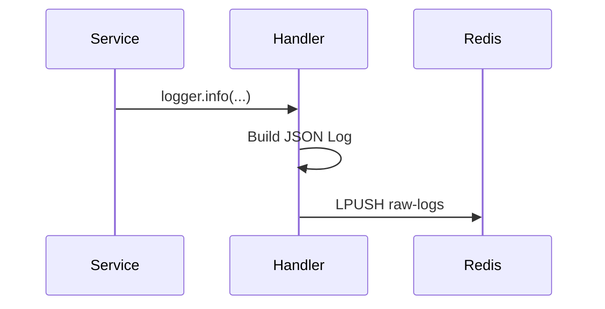
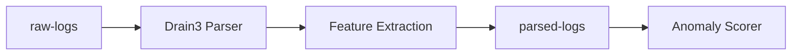
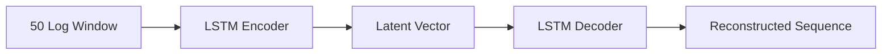
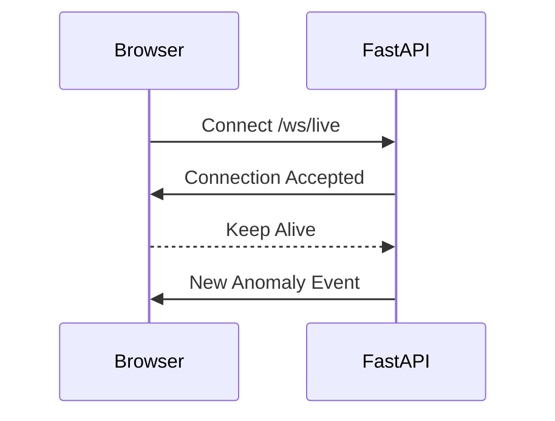
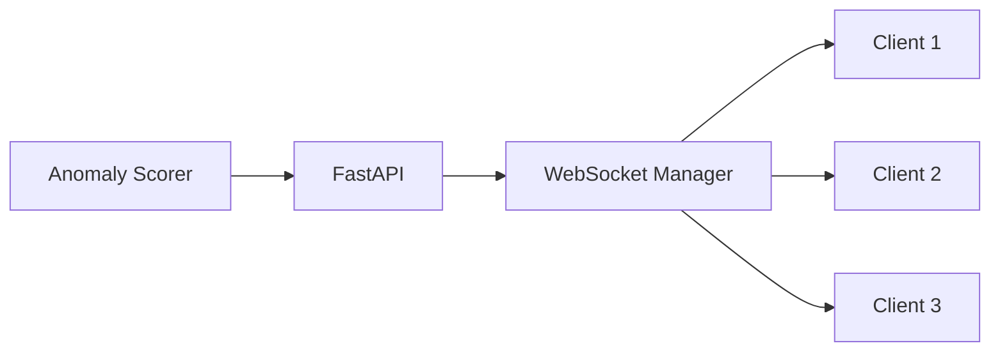
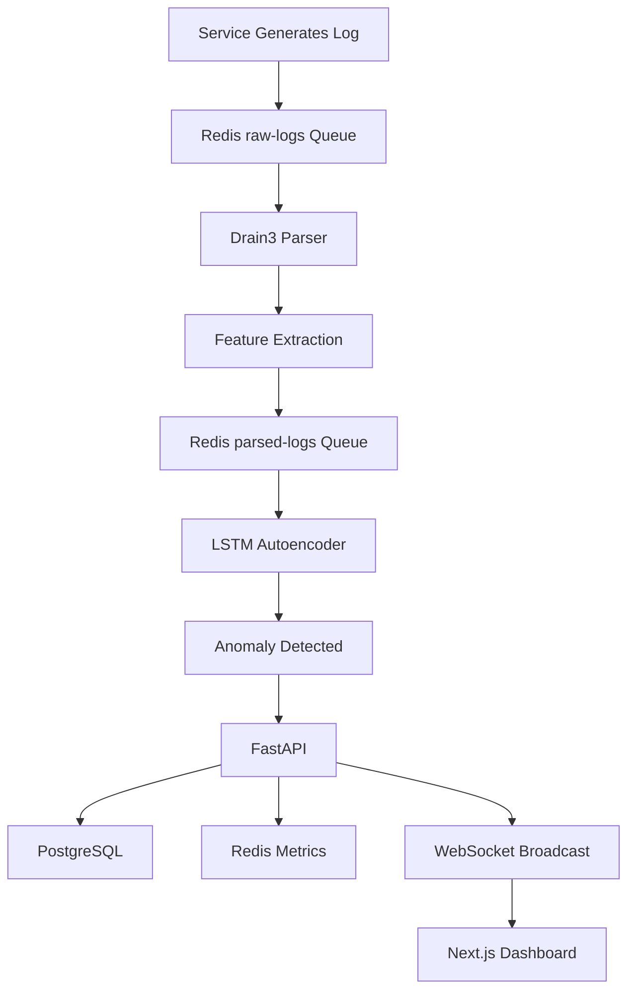

  
# StreamSense  
  
### Real-Time Distributed Log Analytics & ML-Powered Anomaly Detection Platform  
  
Detect abnormal system behavior from distributed microservices using Drain3 log parsing, Redis-based event streaming, and ONNX-powered LSTM Autoencoders.  
  
### 🌐 Live Dashboard  
  
👉 https://stream-sense-ten.vercel.app/  
  

## Highlights

- Event-Driven Architecture using Redis Queues
- Real-Time Log Processing Pipeline
- Drain3 Template Mining
- ONNX LSTM Autoencoders
- FastAPI + WebSockets
- PostgreSQL + Redis Metrics Store
- Live Next.js Dashboard

----------

# Table of Contents

1.  System Overview
    
2.  High-Level Architecture
    
3.  Event-Driven Design
    
4.  Microservices Layer
    
5.  Redis Message Broker
    
6.  Log Processing Pipeline
    
7.  Machine Learning Layer
    
8.  FastAPI Backend
    
9.  Database Design
    
10.  Real-Time WebSocket Streaming
    
11.  Frontend Architecture
    
12.  Performance Optimizations
    
13.  End-to-End Request Lifecycle

14. Scalability Characteristics

15.  Key Engineering Learnings
    

----------

# 1. System Overview

StreamSense is a distributed observability platform designed to detect anomalous system behavior from application logs in real time.

Traditional monitoring systems depend on manually configured alert rules:

```text
IF CPU > 90%
THEN Raise Alert

```

This approach works only for known failure patterns.

StreamSense instead learns what "normal" looks like and automatically identifies unusual behavior without requiring predefined rules.

Examples:

-   Memory leaks
    
-   Latency spikes
    
-   Cascading failures
    
-   Error storms
    
-   Service degradation
    
-   Unusual traffic patterns
    

The system combines:

-   Distributed Microservices
    
-   Redis Message Queues
    
-   Drain3 Log Parsing
    
-   LSTM Autoencoders
    
-   FastAPI
    
-   PostgreSQL
    
-   WebSockets
    
-   React / Next.js
    

----------

# 2. High-Level Architecture



----------

# 3. Event-Driven Design

The entire platform is based on Event-Driven Architecture (EDA).

Instead of services communicating directly with the FastAPI backend:

```text
Service → API → Database

```

services publish logs to Redis queues:

```text
Service → Redis Queue → Workers → Backend

```

This provides several advantages:

### Decoupling

Services do not need to know:

-   Backend address
    
-   Database details
    
-   ML pipeline status
    

They only publish logs.

----------

### Reliability

If:

-   FastAPI crashes
    
-   PostgreSQL becomes unavailable
    
-   ML workers restart
    

logs remain safely stored inside Redis.

No data is lost.

----------

### Scalability

Traffic spikes are absorbed by Redis.

Example:

```text
Normal Traffic:
1,000 logs/sec

Traffic Spike:
50,000 logs/sec

```

Redis acts as a buffer while workers consume messages at their own pace.

----------

# 4. Microservices Layer

Inside:

```text
services/
├── service-a
├── service-b
└── service-c

```

each service simulates a real production application.

Examples:

```python
logger.info("Job completed duration=12ms")
logger.warning("Database response slow duration=400ms")
logger.error("Connection timeout")

```

----------

## Custom Logging Handler

Each service uses:

```python
RedisLoggingHandler

```

Instead of writing logs to disk.

Workflow:



Generated payload:

```json
{
  "timestamp":"2026-01-01T10:00:00Z",
  "service":"service-a",
  "level":"INFO",
  "message":"Job completed duration=12ms"
}

```

----------

# 5. Redis Message Broker

Redis serves as the central communication layer.

----------

## raw-logs Queue

Stores incoming logs.

```text
LPUSH raw-logs

```

Example:

```text
[
  Log 1004
  Log 1003
  Log 1002
]

```

Consumers:

```text
drain_parser.py

```

----------

## parsed-logs Queue

Stores structured logs after parsing.

Consumers:

```text
anomaly_scorer.py

```

----------

## anomaly_zset:{service}

Maintains rolling anomaly history.

Example:

```text
anomaly_zset:service-a

```

Used for:

-   anomaly rate
    
-   trend graphs
    
-   dashboard metrics
    

----------

# 6. Log Processing Pipeline

The processing layer runs independently from the backend.



Workers continuously process batches.

----------

## Batch Processing

Instead of:

```python
while True:
    log = redis.lpop(...)

```

we process:

```python
50 logs at once

```

Benefits:

-   Fewer Redis round trips
    
-   Better CPU utilization
    
-   Higher throughput
    

----------

# 7. Machine Learning Layer

The ML pipeline is responsible for determining whether system behavior is normal or abnormal.

----------

## Step 1: Drain3 Log Parsing

Raw logs contain variable values.

Example:

```text
User 123 logged in
User 456 logged in
User 789 logged in

```

Without parsing:

```text
3 completely different strings

```

Drain3 converts them into:

```text
User <*> logged in

```

Template ID:

```text
Template #17

```

Now the model learns patterns rather than specific values.

----------

## Step 2: Feature Extraction

Parsed logs are transformed into numerical vectors.

Example:

```text
[
  template_id,
  log_level,
  token_count,
  message_length,
  numeric_density,
  service_id,
  hour_of_day,
  template_frequency
]

```

Output:

```python
[17,1,5,28,0.2,0,13,47]

```

----------

## Step 3: Sliding Windows

Machine learning requires context.

Single logs are often meaningless.

Instead we analyze:

```text
Last 50 logs

```

Example:

```text
Window 1:
Logs 1-50

Window 2:
Logs 2-51

Window 3:
Logs 3-52

```

Implemented using:

```python
collections.deque(maxlen=50)

```

----------

## Step 4: LSTM Autoencoder

Each service has its own trained model.

```text
models/

service-a.onnx
service-b.onnx
service-c.onnx

```

Architecture:



----------

## Why Autoencoders?

Autoencoders learn only normal behavior.

Training:

```text
Normal Logs
      ↓
Autoencoder
      ↓
Learns Normal Patterns

```

No anomaly labels are required.

This makes the system:

-   unsupervised
    
-   adaptable
    
-   scalable
    

----------

## Reconstruction Error

Prediction:

```text
Input Window
      ↓
Model
      ↓
Reconstructed Window

```

Error:

```text
MSE(input, reconstruction)

```

Low MSE:

```text
Normal

```

High MSE:

```text
Anomaly

```

----------

## Thresholding

Threshold:

```text
99th Percentile

```

Computed from validation losses.

Example:

```text
Threshold = 0.082

```

Decision:

```text
MSE = 0.021
Normal

MSE = 0.231
Anomaly

```

----------

# 8. FastAPI Backend

The backend performs:

1.  Persistence
    
2.  Metrics Aggregation
    
3.  WebSocket Broadcasting
    

----------

## API Layer

Endpoints:

```text
GET  /metrics
GET  /services
GET  /anomalies

POST /anomaly

WS /ws/live

```

----------

## Async Concurrency

Problem:

```text
PostgreSQL query blocks
↓
Event loop freezes
↓
WebSockets stop responding

```

Solution:

```python
await asyncio.to_thread(...)

```

Blocking operations are moved to worker threads.

Benefits:

-   non-blocking API
    
-   responsive WebSockets
    
-   better throughput
    

----------

## Connection Pooling

Creating PostgreSQL connections repeatedly is expensive.

Instead:

```python
ThreadedConnectionPool

```

Maintains:

```text
20 reusable connections

```

Workflow:

```text
Request
   ↓
Borrow Connection
   ↓
Execute Query
   ↓
Return Connection

```

----------

# 9. Database Design

Anomalies are persisted inside PostgreSQL.

Schema:

```sql
CREATE TABLE anomalies (
    id SERIAL PRIMARY KEY,
    service VARCHAR(100),
    score FLOAT,
    template TEXT,
    message TEXT,
    created_at TIMESTAMP
);

```

Purpose:

-   historical analysis
    
-   dashboard tables
    
-   metrics aggregation
    

----------

# 10. Real-Time Streaming

The dashboard updates instantly using WebSockets.

----------

## Connection Lifecycle



----------

## Broadcast Flow



Latency is typically:

```text
< 100 ms

```

from anomaly detection to browser update.

----------

# 11. Frontend Architecture

Built with:

```text
Next.js 14
React
TailwindCSS
Recharts

```

----------

## Initial Data Load

On startup:

```javascript
Promise.all([
  fetch("/metrics"),
  fetch("/services"),
  fetch("/anomalies")
]);

```

This minimizes page load time.

----------

## Live Updates

After hydration:

```javascript
const ws = new WebSocket(WS_URL);

```

Incoming anomalies immediately update React state.

```javascript
setAnomalies(prev => [event, ...prev]);

```

No page refresh required.

----------

# 12. Performance Optimizations

## Batch Processing

50 logs per pull.

Reduces:

-   network overhead
    
-   Redis calls
    

----------

## ONNX Runtime

Inference runs using:

```text
ONNX Runtime

```

instead of Python training models.

Benefits:

-   lower memory
    
-   faster inference
    
-   deployment simplicity
    

----------

## Persistent HTTP Clients

Instead of:

```python
httpx.post(...)

```

for every anomaly,

we use:

```python
shared_client = httpx.Client()

```

Benefits:

-   TCP reuse
    
-   TLS reuse
    
-   lower latency
    

----------

# 13. End-to-End Request Lifecycle



----------

# 14. Scalability Characteristics

Current architecture supports horizontal scaling of:

-   log generators
    
-   parser workers
    
-   anomaly scorers
    
-   FastAPI replicas
    

Potential upgrades:

```text
Redis → Kafka

Single Worker → Worker Pool

Single Region → Multi Region

PostgreSQL → TimescaleDB

```

----------

# 15. Key Engineering Learnings

During development several production issues were encountered and solved:

-   Event loop starvation causing API timeouts
    
-   Database connection exhaustion
    
-   WebSocket disconnect handling
    
-   Redis queue backpressure
    
-   Efficient batch processing
    
-   Real-time anomaly broadcasting
    
-   Low-latency ML inference
    

These challenges mirror the same problems commonly encountered in large-scale observability and monitoring platforms.

----------

## Conclusion

StreamSense demonstrates how modern distributed systems combine event-driven architecture, machine learning, asynchronous processing, and real-time communication to build intelligent observability platforms capable of detecting failures before they impact users.